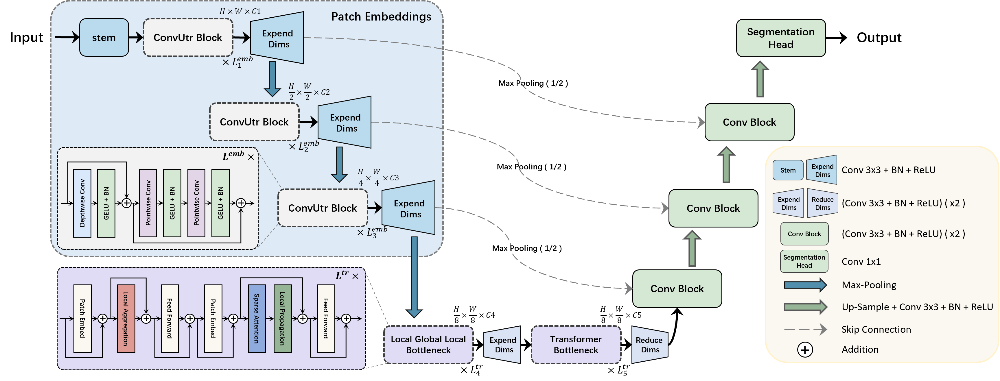
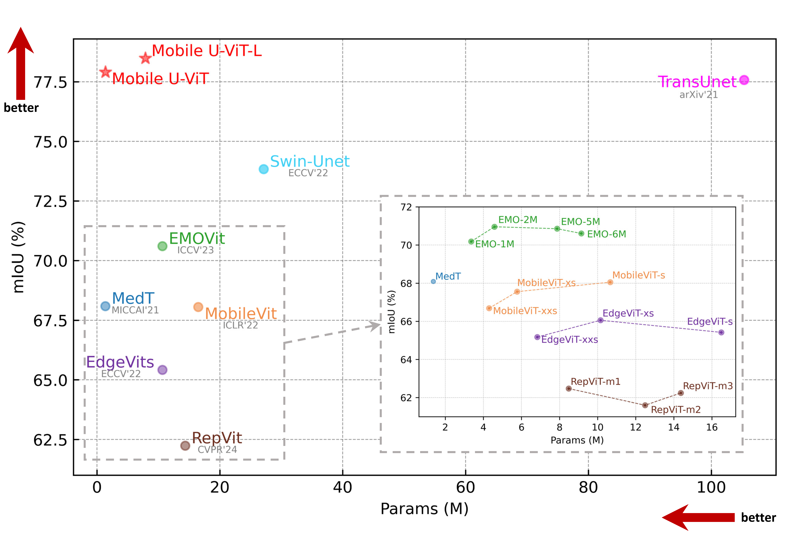

# Mobile U-ViT: Revisiting large kernel \& U-shaped ViT for efficient medical image segmentation


Official pytorch code for "Mobile U-ViT: Revisiting large kernel \& U-shaped ViT for efficient medical image segmentation"


## Introduction
In practical clinical scenarios, the need for prompt execution of medical image analysis tasks on mobile devices with limited resources is evident. However, existing prevailing mobile models originally designed for natural images, exhibit suboptimal performance on medical tasks.  How to combine the mobile models and medical models to build a light-weight, universal, and low-latency network for mobile medical devices remains a challenge. Towards this end, we propose a mobile medical image segmentor termed \textbf{Mobile} \textbf{U-}shaped \textbf{V}ision \textbf{T}ransformer (Mobile U-ViT), a mobile-friendly hybrid architecture that synergizes large-kernel CNNs and U-shaped Vision Transformers (ViTs). 
Specifically, we redesign the patch embedding part, cascaded decoder with downsampled skip-connections to achieve larger receptive fields while minimizing parameters. Furthermore, a Large-kernel Local-Global-Local block with a large kernel is introduced to facilitate the efficient local-to-global information exchange. Extensive experiments on six public medical image datasets with three different modalities demonstrate the superiority of Mobile U-ViT over state-of-the-art methods while boasting lighter weights and a lower computational cost.

### Mobile U-ViT:



## Performance Comparison



## Datasets

Please put the [BUSI](https://www.kaggle.com/aryashah2k/breast-ultrasound-images-dataset) dataset or your own dataset as the following architecture. 
```
└── MobileUtr
    ├── data
        ├── busi
            ├── images
            |   ├── benign (10).png
            │   ├── malignant (17).png
            │   ├── ...
            |
            └── masks
                ├── 0
                |   ├── benign (10).png
                |   ├── malignant (17).png
                |   ├── ...
        ├── your dataset
            ├── images
            |   ├── 0a7e06.png
            │   ├── ...
            |
            └── masks
                ├── 0
                |   ├── 0a7e06.png
                |   ├── ...
    ├── dataloader
    ├── network
    ├── utils
    ├── main.py
    └── split.py
```
## Environment

- GPU: NVIDIA GeForce RTX4090 GPU
- Pytorch: 1.13.0 cuda 11.7
- cudatoolkit: 11.7.1
- scikit-learn: 1.0.2
- albumentations: 1.2.0

## Training and Validation

You can first split your dataset:

```python
python split.py --dataset_name busi --dataset_root ./data
```

Then, train and validate:

```python
python main.py --model ["mobileuvit", "mobileuvit_l"] --base_dir ./data/busi --train_file_dir busi_train.txt --val_file_dir busi_val.txt
```
